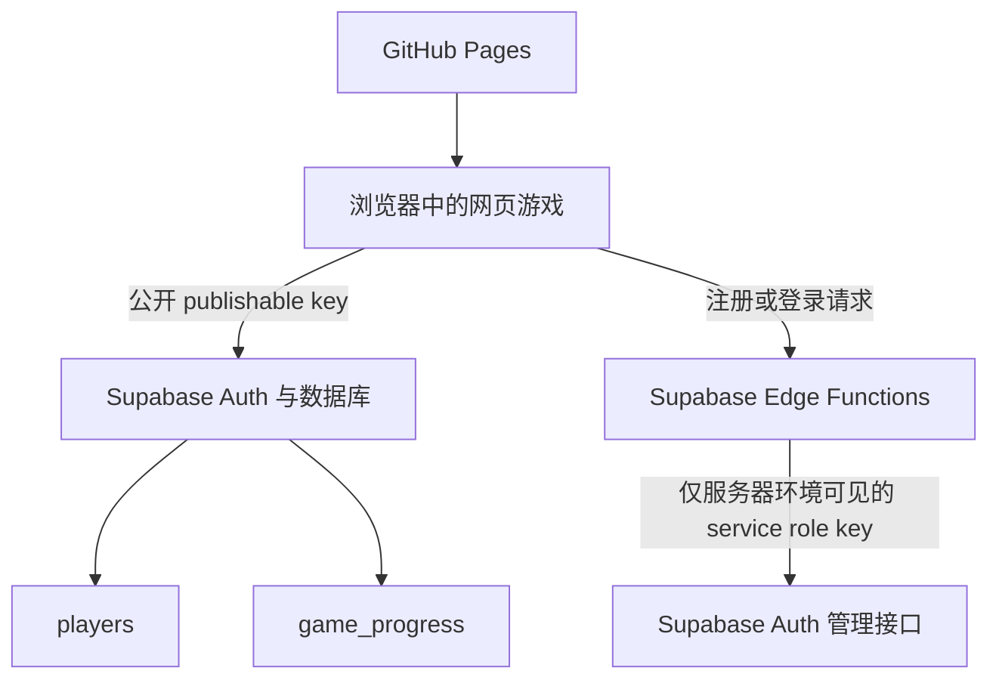

# 肘肘猪（Piggy Island）网站项目报告

**线上网站：** https://17818665698gugeyouxiang-arch.github.io/bijie/  
**代码仓库：** https://github.com/17818665698gugeyouxiang-arch/bijie  
**云端项目：** https://supabase.com/dashboard/project/wevmotwnnzknfclloeyh  
**部署方式：** GitHub Pages 托管静态网站，Supabase 提供账号、认证和云存档。无需自建服务器。

## 1. 网站定位

这是一个轻量、治愈、带一点无厘头互动感的网页小游戏。玩家在天空背景中的圆形草地小岛上，肘击一只四肢着地的卡通猪。游戏的核心乐趣来自肘击节奏、受击反馈、收集多只猪和跨设备保存记录。

整体视觉方向是扁平卡通、柔和配色和手作感，不走高写实或强 3D 风格。猪猪是胖、憨厚、没有明显脖子的形象；平时闭眼，闭眼表现为简单的线条。

## 2. 已完成的页面与视觉设计

### 主画面

- 天空色背景，中央是圆形草地小岛，岛上有简单植物和花朵。
- 猪猪位于小岛视觉中心，名字标签显示在猪猪上方，点击标签可改名。
- 顶部显示当前猪的肘击次数，以及所有猪的累计肘击次数。
- 底部中央有浅色的“肘击”主按钮，并支持空格键触发。
- 右侧是“我的猪猪”快捷栏，可切换、创建和删除猪猪。

### 昼夜主题

- 顶部昼夜按钮可切换白天和黑夜。
- 白天使用当前的浅蓝天空。
- 黑夜使用深蓝天空、星星闪烁，并以 30% 概率生成月亮。
- 昼夜选择会保存在本地和登录后的云存档中。

### 猪猪表现

- 猪猪在待机时有轻微呼吸感。
- 每约 5 秒会进行一次耳朵摇动动画。
- 猪猪和小岛在切换不同猪时会做空间转场：旧场景更快地向左并缩小离场，新场景从右侧以相同高度进入并放大，形成前后景深感。

### 按钮反馈

- 所有可操作按钮均有悬停反馈：鼠标移上去会平滑变深。
- 已保留肘击按钮、模式按钮等原本的位移或状态反馈。
- 禁用按钮不会显示悬停反馈。

## 3. 肘击交互规则

### 普通／缓慢肘击

- 顶部“缓慢肘击”按钮表示默认模式。
- 一次完整动作约为 1 秒：手臂落下、肘部接触、手臂收回。
- 肘击次数只会在完整动作结束后增加 1，不能在动作途中重复计数。
- 粒子效果出现概率为 50%。

### 快速肘击

- 顶部按钮可切换为“快速肘击 ×3”。
- 快速模式只改变动画节奏，不改变单次肘击的分数：完整动作约 333 毫秒，为默认速度的 3 倍。
- 肘部实际接触猪猪的那一刻，眩晕眼、猪猪压扁反馈和粒子会同时触发。
- 眩晕眼的旋转和粒子动画也同步加快为 3 倍速度。
- 快速模式粒子出现概率提升到 80%。

### 受击反馈

- 受击效果统一为眩晕眼：原来的闭眼会被遮住，不会和眩晕眼重叠。
- 两只眩晕眼会在闭眼原位置旋转，左右旋转方向相反。
- 猪猪接触时会短暂压扁并回弹。
- 粒子从肘部碰撞点向外扩散；粒子使用星形、圆点和暖色调。
- 所有效果仅在肘部接触之后显示，动作结束后清除。

## 4. 多猪管理与本地记录

- 每只猪都有独立名称和独立肘击次数。
- 用户可以创建新猪、改名、删除猪和切换当前猪。
- 猪名会进行 Unicode 规范化、去除首尾空格并忽略大小写比较，因此不能创建两个等价名称的猪。
- 名称长度限制为 1–20 个字符。
- 未登录时数据会存入浏览器 `localStorage`，用作离线缓存。

## 5. 在线账号与云存档

### 账号规则

| 项目 | 规则 |
| --- | --- |
| 用户名 | 仅英文字母 A–Z / a–z，1–10 位，不区分大小写 |
| 密码 | 仅数字，至少 8 位，不设上限 |
| 注册 | 需要用户名、密码、确认密码 |
| 登录失败提示 | `Account not found.` 或 `Incorrect password.` |

注册成功后会自动登录，并将当时的本地猪猪记录导入该账号的初始云存档。以后游戏进度变化时，界面会先更新，再自动同步到 Supabase。登录或刷新页面时，会以云端进度为准恢复游戏；本地记录只是离线缓存。

### 当前保存内容

当前云存档已保存：

- 所有猪猪的 ID、名字、肘击次数
- 当前选中的猪
- 全部肘击次数
- 昼夜主题
- 普通／快速肘击模式
- `coins`、`level`、`xp`
- `upgrades`、`unlocked_content`、`achievements`
- `inventory`、`purchased_items`、`statistics`

后面即使加入金币、等级、道具、皮肤、成就或商店，也已经有对应的云存档字段可继续使用。

## 6. Supabase 技术结构与安全设计

### 服务分工

### 数据库表

| 表 | 用途 | 主要字段 |
| --- | --- | --- |
| `players` | 玩家公开资料 | `id`、`username`、`username_normalized`、`created_at`、`last_login_at` |
| `game_progress` | 玩家云存档 | `player_id`、`hits`、`coins`、`level`、`xp`、`piggies`、`settings`、`statistics` 等 |
| `private.auth_rate_limits` | 注册与登录限流 | IP/操作键、尝试次数、时间窗口 |

完整建表、触发器、RLS 和权限 SQL 位于：[001_players_and_progress.sql](supabase/migrations/001_players_and_progress.sql)。

### 认证与密码安全

- 自定义“用户名 + 数字密码”界面由两个 Supabase Edge Function 实现：`auth-signup` 和 `auth-login`。
- 函数在服务器端把用户名映射为内部邮箱标识，再调用 Supabase Auth。
- 密码哈希由 Supabase Auth 管理，项目的 `players` 表不保存明文密码，也不复制密码哈希。
- 用户名标准化为小写，确保 `Tom`、`tom` 和 `TOM` 不能重复注册。
- 注册和登录按 IP 分别限制为 10 分钟内最多 10 次尝试。
- Edge Function 只允许 GitHub Pages 网站和本地开发地址跨域调用。

### Row Level Security（RLS）

- `players`：登录玩家只能读取自己 ID 对应的一行资料。
- `game_progress`：登录玩家只能读取、更新 `player_id = auth.uid()` 的一行存档。
- 未登录的 `anon` 角色没有访问这两张表的权限。
- 客户端即使手工修改 `player_id`，RLS 仍会拒绝读取或写入别人的存档。

### 密钥规则

- 前端配置文件只使用 Supabase `publishable`／`anon` key；它本身可公开给浏览器。
- `service_role key`、`sb_secret_...`、数据库密码和个人访问令牌绝不能放进 GitHub、网页 JS 或聊天转发内容。
- `service_role key` 只由 Supabase Edge Function 的服务器环境读取。

## 7. 代码与资源位置

| 文件 | 内容 |
| --- | --- |
| [dist/index.html](dist/index.html) | 页面结构、按钮、对话框和外部脚本加载 |
| [dist/style.css](dist/style.css) | 完整视觉样式、主题、动画、受击和悬停反馈 |
| [dist/app.js](dist/app.js) | 游戏状态、肘击动画、多猪管理、切换转场、云存档同步 |
| [dist/assets/pig.png](dist/assets/pig.png) | 猪猪插画资源 |
| [dist/assets/island.png](dist/assets/island.png) | 草地小岛插画资源 |
| [dist/assets/arm.svg](dist/assets/arm.svg) | 肘击手臂资源 |
| [dist/supabase-config.js](dist/supabase-config.js) | 前端 Supabase URL 与公开 key 配置 |
| [supabase/functions/auth-signup/index.ts](supabase/functions/auth-signup/index.ts) | 注册 Edge Function |
| [supabase/functions/auth-login/index.ts](supabase/functions/auth-login/index.ts) | 登录 Edge Function |
| [SUPABASE_SETUP.md](SUPABASE_SETUP.md) | Supabase 设置、部署和安全说明 |

## 8. 部署与当前版本

- GitHub Pages 通过 GitHub Actions 部署 `dist` 目录。
- 网站部署路径适配仓库子路径：`https://USERNAME.github.io/REPOSITORY-NAME/`。
- Supabase 项目已经连接到网站所使用的配置。
- 最近功能提交：
  - `af45c65`：所有按钮增加鼠标悬停变深反馈。
  - `1a6f298`：增加快速肘击模式、80% 粒子和云端模式保存。
  - `7fbf660`：密码规则改为至少 8 位数字、不设上限。
  - `f0f2fde`：账号、Supabase Auth 和云存档基础功能。

## 9. 已完成的验证

- 快速模式按钮会正确切换状态，并保存为 `fast`。
- 快速肘击的 Web Animation 时长为约 333.33 毫秒。
- 肘部接触时会显示眩晕眼和粒子；快速模式验证为 16 个粒子。
- 动作未结束前肘击计数不增加，结束后才增加 1。
- 动作结束后眩晕、粒子和快速状态类会被清理。
- 主要按钮在悬停后都检测到 `brightness(0.88)` 的变深效果。
- JavaScript 语法检查和 Git diff 检查均通过。

## 10. 可继续讨论的设计方向

目前基础互动和账号存档已完成，后续适合和设计讨论对象一起确定：

1. **成长目标：** 肘击次数是否换取金币、经验和等级；等级是否解锁新的岛屿或装饰。
2. **收集内容：** 不同猪皮肤、岛屿主题、手臂外观、粒子主题或称号。
3. **反馈层次：** 连击、特殊稀有受击、音效、震动和成就提示。
4. **社交展示：** 玩家主页、猪猪图鉴、排行榜或可分享的猪猪卡片。
5. **移动端体验：** 目前已有响应式布局；可继续优化顶部工具栏、触摸反馈与振动支持。

## 11. 给设计讨论对象的简短说明

“肘肘猪”已经不是单页演示，而是一个可在不同设备登录、保留多只猪和长期成长数据的轻量网页游戏。当前设计重点是把每一次肘击做得清楚、有节奏、有反馈；下一阶段最需要确定的是玩家为何持续肘击，以及可以通过肘击解锁和展示什么。
